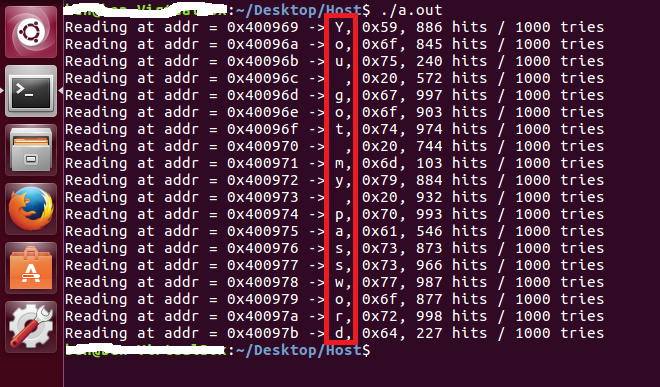

# Spectre
In this demo, we will dump user data without reading it.
If you translate the code into Javascript, you could dump IE browser data.

## How to build & run on Linux?
1. `gcc spectre.c`
2. `./a.out`

## How to build & run on Windows?
1. Open spectre.win/spectre.sln
2. Build & run

If everything is ok, You will get victim data: "You got my password"
